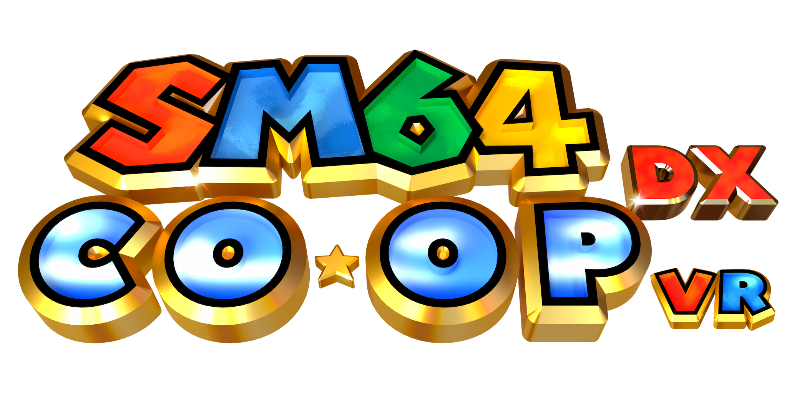

<p align="center">
  
</p>

<p align="center">
  <a href="https://github.com/fulldivegames/sm64coopdx-VR"><strong>PC VR edition</strong></a>
  &nbsp;|&nbsp; <strong>Quest standalone edition</strong>
</p>

<h1 align="center">SM64 Co-Op DX VR — Quest Standalone</h1>

<p align="center">
  Native ARM64/OpenXR VR for Meta Quest. No PC is required after installation.
</p>

> [!WARNING]
> This is an active, experimental fan project. The standalone edition has been tested on **Meta Quest 3 only**. It has **not been tested on Quest 2 at all**, and neither edition has been tested across every level, multiplayer situation, ROM hack, or mod combination.

This repository contains the standalone Android/Quest port of [SM64 Co-Op DX VR for PC](https://github.com/fulldivegames/sm64coopdx-VR), derived from [SM64 Co-Op DX](https://github.com/coop-deluxe/sm64coopdx). It runs the game natively on the headset through OpenXR and OpenGL ES while retaining the original project's multiplayer foundation, Lua/mod support where compatible, first- and third-person cameras, tracked hands, and physical VR interactions.
There are videos on my YouTube channel: https://www.youtube.com/@fulldivegames667 that show off the mod.

## Download and install with SideQuest

The release is a single APK. Players do not need Git, Android Studio, Gradle, ADB commands, or a PC VR streaming application.

### Requirements

- Meta Quest 3 (the only tested standalone headset)
- Developer Mode enabled for the headset
- [SideQuest](https://sidequestvr.com/setup-howto) installed on a computer
- A USB data cable or an already configured SideQuest wireless connection
- Your own legally obtained, unmodified **Super Mario 64 US `.z64` ROM**

### Install the APK

1. Open this repository's [latest release](https://github.com/fulldivegames/sm64coopdx-VR-Standalone/releases/latest).
2. Download `SM64-Co-Op-DX-VR-Quest-v0.5.8.apk` under **Assets**.
3. Connect the Quest to your computer and allow the USB debugging prompt inside the headset.
4. Open SideQuest and confirm that the headset indicator is connected.
5. Click **Install APK file from folder** in SideQuest, choose the downloaded APK, and wait for the install-success message.
6. In the headset, open the App Library, select **Unknown Sources**, and launch **SM64 Co-Op DX VR**.
7. On first launch, use the Android file picker to select your own unmodified US `.z64` ROM. Placing the ROM in the headset's **Downloads** folder beforehand makes it easy to find.
8. After the ROM finishes importing, the app will likely close. This is expected; simply reopen **SM64 Co-Op DX VR** from **Unknown Sources**.
9. Stand comfortably, face forward, and use **Settings > VR > Recalibrate Tracking** if the initial height or direction is wrong.

Updates can be installed over the existing app through SideQuest. Keep the same Android application installed if you want its private ROM/configuration data to remain available. Back up important saves before testing a new release.

> [!IMPORTANT]
> Install v0.5.8 directly over an existing installation so the private ROM, save, and settings remain available. Do not uninstall the app first.

> [!IMPORTANT]
> The APK contains no ROM and no Nintendo game assets. Do not upload, bundle, or redistribute a ROM with this project. The app validates the unmodified US ROM before importing it into private application storage.

## Install mods

Starting with v0.5.7, the standalone build loads compatible SM64 Co-Op DX mods from this easy-to-access folder on the Quest:

```text
/sdcard/SM64VR/mods/
```

1. Install or update to v0.5.7 and launch it once. Android opens the **Allow access to manage all files** page; enable access for **SM64 Co-Op DX VR Standalone**. This permission is used only for the shared mod folder.
2. Close and reopen the game once after granting access. The game creates `/sdcard/SM64VR/mods/` automatically.
3. Download a mod compatible with SM64 Co-Op DX. The official community browser is [mods.sm64coopdx.com](https://mods.sm64coopdx.com/mods/).
4. Extract the archive. Copy the **extracted mod folder**, not the `.zip`, into `SM64VR/mods` with SideQuest's file manager. The mod files must be directly inside their own folder rather than inside an extra duplicate folder.
5. Fully close and reopen **SM64 Co-Op DX VR**. From the main menu, open **Host > Mods**, select the installed mod, and start the game. Use **Refresh** if the mod was copied while the app was open.

You can also create the folder and transfer an extracted mod with ADB:

```powershell
adb shell mkdir -p /sdcard/SM64VR/mods
adb push "C:\path\to\ExtractedModFolder" /sdcard/SM64VR/mods/
```

The previous private `Android/data/com.fulldivegames.sm64coopdxvr/files/mods/` location remains a compatibility fallback. If the special file-access permission is declined, mods already stored there continue to load, but `/sdcard/SM64VR/mods/` is unavailable.

Not every desktop mod is compatible with the standalone ARM64/OpenGL ES build. Mods that depend on desktop-only code, very large model or texture packs, and demanding ROM hacks may fail to load or run poorly. Install one mod at a time when troubleshooting. Only download mods you trust, and do not redistribute copyrighted game assets.

## Default Quest controls

| Action | Default input |
| --- | --- |
| Move | Left thumbstick |
| Smooth turn / camera | Right thumbstick |
| Jump / cannon fire | Right Primary (A) |
| Attack / interact | Right Secondary (B) |
| Crouch | Left Trigger |
| L button | Left stick click |
| R button | Right stick click |
| Pause | Left Menu button |
| Close fist / physical grab | Hold that hand's Grip |
| Optional button punch | Right Trigger; disabled by default |

Open **Settings > VR > Controller Settings** to exchange the movement/camera sticks, remap the listed actions, or disable individual bindings.

## How to play in VR

### First person and movement

First Person Mode is the default. The headset controls the view and, by default, Mario's forward direction. The stick controls travel while Mario retains his established acceleration, momentum, skids, jumps, and landings. Camera Settings can instead use the left or right controller as the calibrated facing source.

Swimming, Wing Cap flight, shell riding, cannon aiming, and pole dismounts follow the configured look direction. Looking up or down controls vertical swimming and flight. A normal action press is still required for swimming strokes.

Third Person Mode remains available for players who prefer the original character-focused camera and conventional controls.

### Punching

Hold a Grip to close that glove, then make a deliberate punching motion. The tracked glove is the attack point; Mario's body does not need to face the target. Punch speed, travel distance, grip threshold, and collider length are adjustable under Motion Control Settings.

### Grabbing, carrying, and throwing

Close either Grip while its glove overlaps an object the original game permits Mario to carry, such as a Bob-omb, Mips, or a baby penguin. Keep holding to carry it at the hand. Release gently to drop it, or release while moving the hand to throw it. Taking damage forces the normal game drop even if the Grip remains held.

Normal, Wing, Metal, and Vanish Caps can also be collected by touching them with a tracked glove.

### Motion-controlled diving

Punch both hands forward within the configured timing window. In the air this can trigger a dive; while running fast enough on the ground it can trigger a running dive. Air and ground motion dives have separate switches.

### Physical crouching and ground pounds

Lower the headset below roughly two-thirds of the calibrated standing height to hold Mario's crouch. Crossing that threshold while airborne triggers a ground pound. This option is enabled by default under Immersion.

### Bowser

Reach either glove to Bowser's tail and hold that Grip. Swing the held hand around your body to build spin speed, then release to throw in the physical hand-swing direction. The camera stick can assist turning, and acceleration/maximum speed are adjustable.

### Physical climbing

Physical climbing is enabled by default, while Mario's standard automatic climbing is disabled by default.

- **Poles and trees:** touch one with a glove and hold Grip. Pull yourself, change anchors with the other hand, or release both hands to fall. Hold the movement stick downward while gripping to slide down. Near the top 3% of a pole/tree—or once the headset is within the top detection window—Jump performs Mario's native top-of-pole flip.
- **Moving poles:** the player, grip anchor, collision, and visible pole follow the platform together.
- **Hangable ceilings and monkey bars:** hold Grip before or while jumping into the actual underside, then alternate hands to move. The body is hidden during the physical climb to prevent clipping.
- **Ledges:** move the headset over a safe ledge and release Grip to finish onto the top. A fast release can swing off toward the configured facing direction.
- **Native ledge body:** Model Settings > Body Settings > Hide Body While on Ledges is enabled by default for ledge grabs, hangs, climb-downs, and pull-ups.
- **Climb Any Wall or Ceiling:** the disabled-by-default Cheats option permits close fresh grips on ordinary walls and overhead ceilings. Floors, boxes, cap blocks, and breakable blocks remain excluded.

### Collection gestures

- During a star/key collection screen, hold **Grip + Trigger** on either hand to show Mario's peace-sign glove.
- During a successful painting/course exit, bring either **Grip + Trigger** hand to the headset or just above it to pull off the cap. Keep holding to carry it; release to throw it. The cap can be picked up again or returned to Mario's head. The disabled-by-default **Grab Cap at Any Time** option enables this throughout play.

## Comfort, immersion, and visual options

All options in **Settings > VR > Immersion** default to enabled:

- Smooth crouch and sinking-surface camera motion
- Full-view face-stuck blackout with readable stereo text
- Cannon aim-direction cone, firing lockout, and four directional arrows
- Head-tracked horizontal 3D positional sound
- Camera movement with Mario's ledge catch and pull-up animation
- A light 25%-opacity castle-water-blue filter only while the headset is underwater
- Side-flip camera follow
- 180-degree wall-jump camera turning
- Physical crouching and ground pounds

Painting entries use a short white comfort fade. The optional True First Person and True Diving camera effects remain experimental and can cause motion sickness.

## Settings overview

| Submenu | Main controls |
| --- | --- |
| Camera Settings | Camera mode, height/position, FOV, facing source, facing calibration, and standalone color controls |
| Controller Settings | Motion-controller enablement, stick selection, button mappings, and optional trigger punch |
| Motion Control Settings | Punching, grabbing, climbing, dives, jump turning, hit ranges, and Bowser tuning |
| Model Settings | Body visibility/placement, feet-only, ledge and pole-flip visibility, glove scale, rotation, and position |
| Performance | Render scale from 10%-100% (80% default), optional FPS counter, and standalone performance options |
| HUD Settings | HUD opacity and corner spread |
| Immersion | Default-on comfort, audio, camera, underwater, cannon, and physical-crouch options |
| Effects | Twirl tornado visual effect |
| Cheats | Climb-any-surface, flying speed, swimming speed, and running speed |
| Experimental | True First Person, True Diving, Arms Mode, and original movement options |

## Standalone-specific notes

- Quest color grading uses slightly deeper saturation and contrast than the PC build to reduce the washed-out appearance seen on Quest 3. The Brightness value itself is unchanged.
- The game keeps Super Mario 64's deterministic 30 Hz gameplay simulation while rendering and tracking at the headset cadence. Physics are not globally accelerated.
- Render Scale defaults to 80% and can be adjusted from 10% through 100%. Lower it if a demanding level or mod cannot maintain headset refresh. Menus remain full resolution.
- Multiplayer code remains present, but standalone online co-op has not been comprehensively validated.
- Large Lua mods, model packs, ROM hacks, and texture packs may exceed standalone memory/performance budgets or rely on desktop-only behavior.

## Troubleshooting

- **App is missing:** open the App Library's **Unknown Sources** category.
- **ROM picker rejects the file:** use an unmodified US `.z64` ROM. Other regions and modified ROMs are not accepted.
- **App closes after importing the ROM:** this is expected on the first import. Reopen the game from **Unknown Sources** and it should load normally.
- **Wrong height or facing:** use **Settings > VR > Recalibrate Tracking** while standing neutrally and looking forward.
- **Poor performance:** lower Render Scale, disable expensive mods, and restart the headset after long development/testing sessions.
- **Controls feel wrong:** reset Controller Settings and Camera Settings, then recalibrate the selected facing source.
- **Updating fails:** uninstalling removes private app data. Prefer installing the newer APK over the existing package and back up saves first.

## Building from source

Player releases should be installed through the APK above. Developers can build from `platform/android` with Android SDK/NDK 27, Java, Gradle, CMake, and Ninja configured:

```powershell
cd platform\android
.\gradlew.bat assembleDebug
```

The debug APK is produced under `platform/android/app/build/outputs/apk/debug/`. A ROM must never be added to the repository or APK.

## Credits and legal notice

- [SM64 Co-Op DX](https://github.com/coop-deluxe/sm64coopdx) and the Coop Deluxe Team
- [sm64ex-coop](https://github.com/djoslin0/sm64ex-coop) and its contributors
- The Super Mario 64 decompilation and PC-port contributors
- [Khronos OpenXR](https://www.khronos.org/openxr/) and Meta's Android/OpenXR platform components
- Lua 5.3.5, included under its MIT-style license in `platform/android/third_party/lua-5.3.5/doc/readme.html`

This is an unofficial fan project and is not affiliated with or endorsed by Nintendo, Meta, the SM64 Co-Op DX team, SideQuest, or Khronos. Super Mario and related names, characters, and assets belong to their respective owners. This repository does not grant permission to redistribute Nintendo ROMs or game assets.
